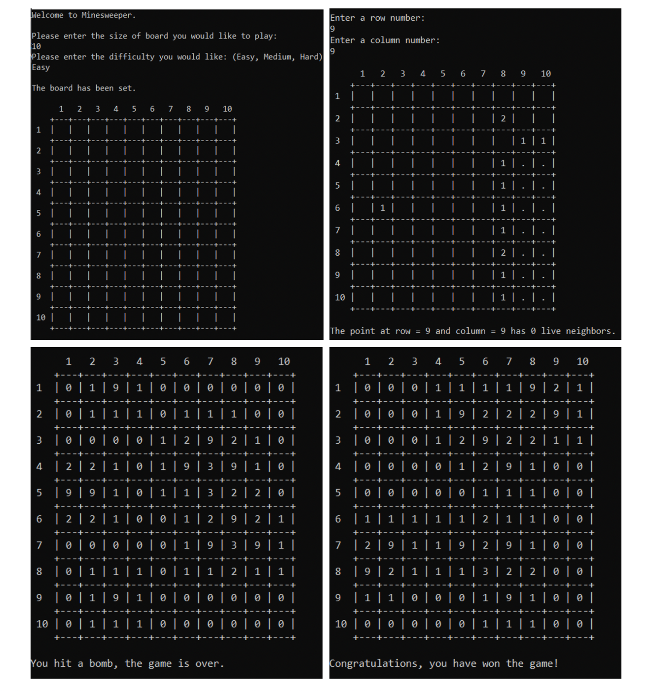
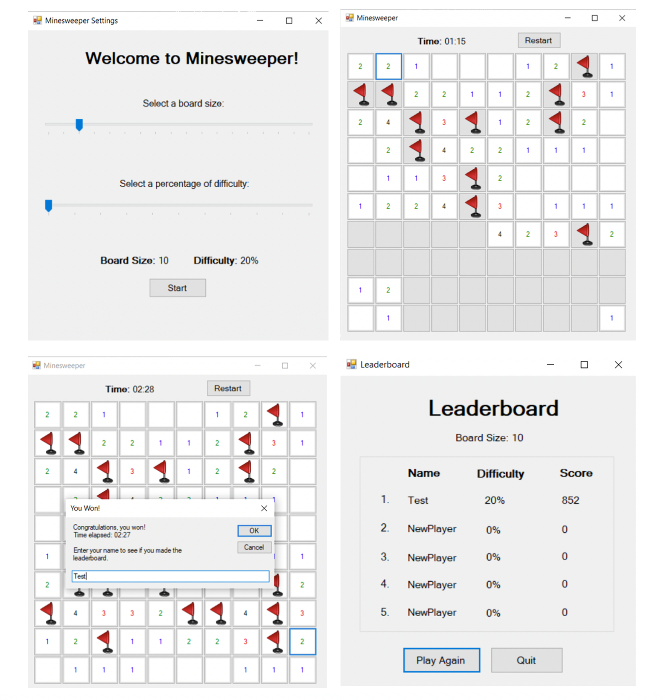

# Minesweeper

Using Microsoft Visual Studio, I created the game of Minesweeper. A user is able to select a percentage of difficulty and a desired board size before playing. If the game is completed, the user's score is calculated and the top 5 scores of the given board size are pulled from a text file and displayed.

This game was developed over a 6 step process.

	1. Console Application – Create Board, Cell, and Program classes
	2. Interactive Playable Version – Game loop, selecting grid spaces
	3. Using Recursion – Add a function to reveal cells with no live neighbors
	4. GUI Version – Create windows form that displays clickable cells
	5. Combining GUI and Game Logic – Add game logic to make windows form playable
	6. Player Stats Class – Add class and additional form for player stats

<h2>Design</h2>

The planning for this project included uses tools such as UML diagrams to determine class relationships, wireframes to outline each layout, as well as sitemap for page navigation. Below is a display of each of my UML diagrams and the sitemap used.

<h3>UML Diagram</h3>

	

<h3>Wireframes</h3>

	

<h2>Console Application</h2>

Before creating the window forms, I developed a console application to build the foundation of minesweeper. This included all of the game logic that the end product would have without the UI design.

<h3>Console Application<h3>

	

<h2>Final Product</h2>

The final product for this project was a working windows form application replicating the standard minesweeper game. Below are each of the forms showing the finished design and functioning game.

<h3>Game Forms<h3>

	

