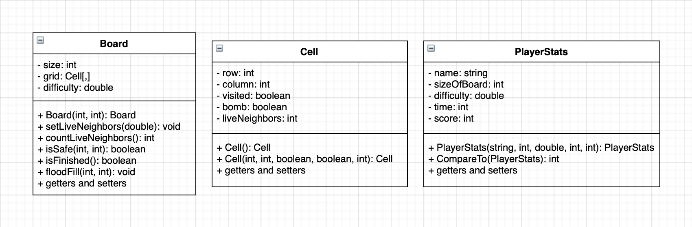

# Minesweeper - Spring 2020

Using Microsoft Visual Studio, I created the game of Minesweeper. A user is able to select a percentage of difficulty and a desired board size before playing. If the game is completed successfully, the user's score is calculated and the top 5 scores of the given board size are pulled from a text file and displayed.

This game was developed over a 6 step process:

	1. Console Application – Create Board, Cell, and Program classes
	2. Interactive Playable Version – Game loop, selecting grid spaces
	3. Using Recursion – Add a function to reveal cells with no live neighbors
	4. GUI Version – Create windows form that displays clickable cells
	5. Combining GUI and Game Logic – Add game logic to make windows form playable
	6. Player Stats Class – Add class and additional form for player stats

<h2>The Game</h2>

In creating this project, I used various classes and forms to follow the MVC design pattern. Those classes as well as the recursive method needed are shown below.

<h3>Classes</h3>

	

<h3>Logic</h3>
<i>Flood Fill -</i> Flood fill is a recursive method within the board class that takes in the row and column of a cell, and reveals the neighboring cells that do not have live bombs nearby. As shown below, this function checks to see if the passed in row and column is a valid cell, not a bomb, and not visited. If all of those statements are true, that cell is set to true and checks to see if this cell point has any live neighbor bombs. If there are neighbor bombs the function will  return, otherwise it will continue and recursively call itself.
  

	

<h2>Console Application</h2>

Before creating the window forms, I developed a console application to build the foundation of minesweeper. This included all of the game logic that the end product would have without the UI design.

<h3>Playable Console App<h3>

	

<h2>Final Product</h2>

The final product for this project was a working windows form application replicating the standard minesweeper game. Below are each of the forms showing the finished design and functioning game.

	

